# Account Permission Management

## Motivation
In order to establish a coherent process for requesting permissions, we needed a web based tool that fits certain requirements: 
<ins>From a users perspective</ins>, it must be easy to access to tool itself, easy to use and as self-explanatory as possible. 
Also, the user must be able to request permissions for multiple products/services at once.
And, of course, not only for himself but others as well.

<ins>From an admins perspective</ins>, you want to get notified about new requests, have all relevant data in a nice overview and be able to easily accept or reject them.
You also want a list of all known users and their cumulated, granted permissions. And, of course, an audit-log!

## Features

* AAD SSO integration
* Request permissions for self or others
* Simple and self-explanatory UI
* Audit-log
* Mail-notification for new, granted and refused requests
* Expiry-notification
* Userpermission overview
* List own Requests
* Show granted Permissions
* List soon expiring permissions
* Edit permission requests
* Sync Azure Devops Projects
* Config-Option to limit valid mail-suffixes

## Requirements
* Docker
* MySQL or MariaDB

## Replacements
There are some areas, where company-specific details are used/required. 
You need to change those placeholders:
* azure-pipelines.yml -> _you might want to specify your registry_
* resources/static/toolbox.js (isValidTargetUserMail) -> _checks the valid mail-domains in the frontend_
* resources/messages.xml (notification.request.created.text) -> _URL to where the tool is hosted_
* resources/messages_de.xml (notification.request.created.text) -> _URL to where the tool is hosted_
* resources/messages_en.xml (notification.request.created.text) -> _URL to where the tool is hosted_
* resources/templates/adoSettings.html -> _link to project in ADO_
* resources/application.properties -> _well ...obviously_
* resources/database.mysql.schema/db-initial-data.sql -> _must be adapted to your needs/environment_

## Screenshots

### User Interface
[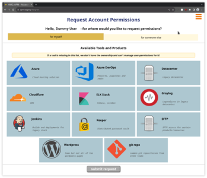](screenshots/request-page_1.png)
[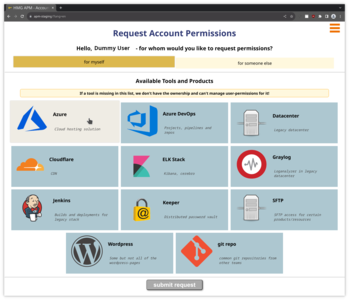](screenshots/request-page_2.png)
[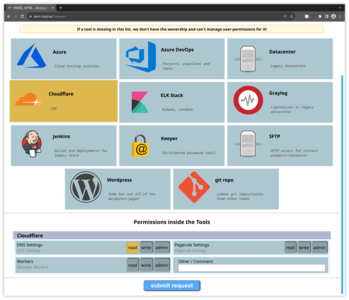](screenshots/request-page_3.png)
[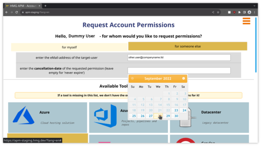](screenshots/request-page_4.png)

[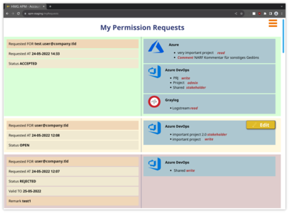](screenshots/my-requests-page_1.png)
[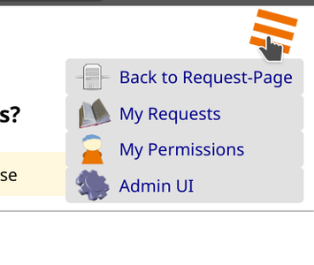](screenshots/request-page_usermenu_1.png)

### Admin Interface
[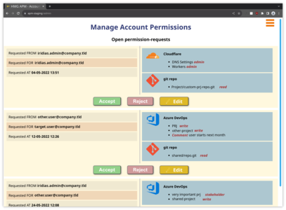](screenshots/admin-page_1.png)
[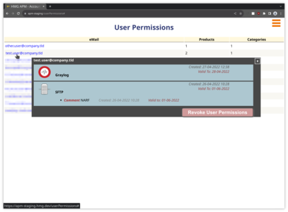](screenshots/admin-user-permissions_1.png)
[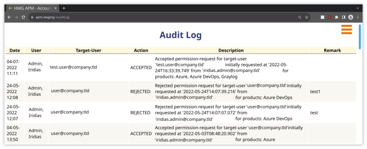](screenshots/admin-audit-log_1.png)
[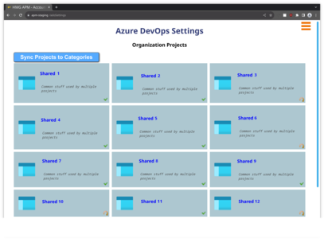](screenshots/admin-ado-sync_1.png)
[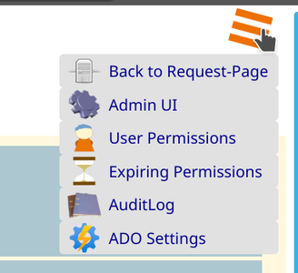](screenshots/admin-menu_1.png)
